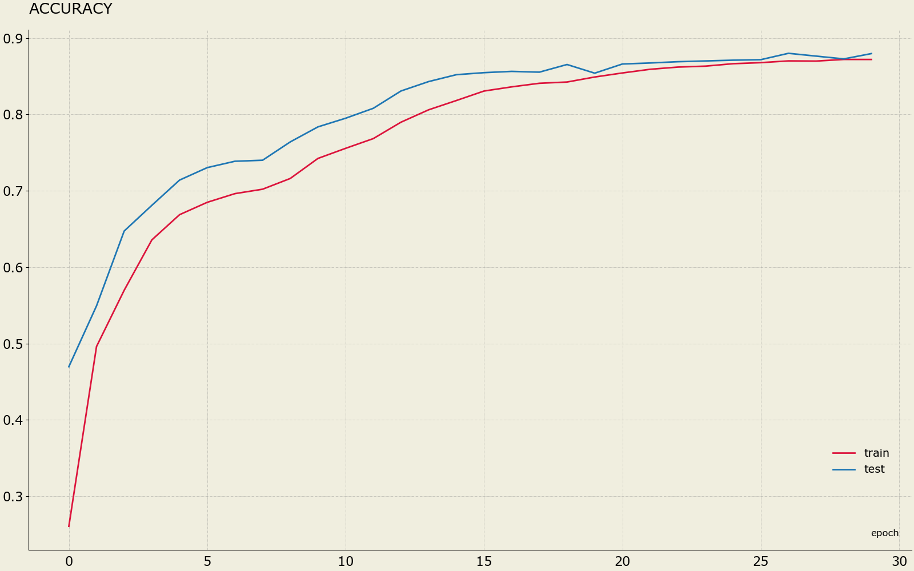
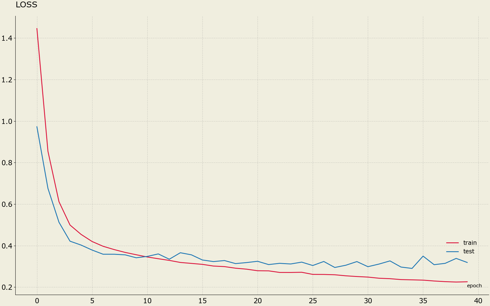

# Numpy CNN

## Hit the ground running

Via Conda
```sh
# setup conda environment & install all required packages
conda env create -f environment.yml
# activate conda environment
conda activate NumpyCNN
```

Via Virtualenv
```sh
# set up python environment
apt-get install python3-venv
python3 -m venv .env
# activate python environment
source .env/bin/activate
# install all required packages
pip install -r requirements.txt
```

## Demo

[Check][5] how to use the created library to create a Convolutional Neural Network capable of classifying MNIST images, with 90% accuracy, using only NumPy.

<p align="center"> 
    
</p>

<p align="center"> 
    <b>Figure 1.</b> Validation set accuracy / epoch 
</p>

<p align="center"> 
    
</p>

<p align="center"> 
    <b>Figure 2.</b> Validation set loss / epoch 
</p>

## References

1. CS231n: Convolutional Neural Networks for Visual Recognition - [link][1]
2. One of the most clear implementations of CNN in NumPy - [link][2]
3. High Performance Convolutional Neural Networks - [link][3]
4. Fast Convolution Algorithms - [link][4]

[1]: http://cs231n.stanford.edu/
[2]: https://github.com/lpraat/numpyCNN
[3]: https://hal.inria.fr/inria-00112631/document
[4]: https://www.youtube.com/watch?v=agYZcJNmbsU
[5]: https://github.com/SkalskiP/ILearnDeepLearning.py/blob/master/01_mysteries_of_neural_networks/06_numpy_convolutional_neural_net/notebooks/CompleteCNN.ipynb
