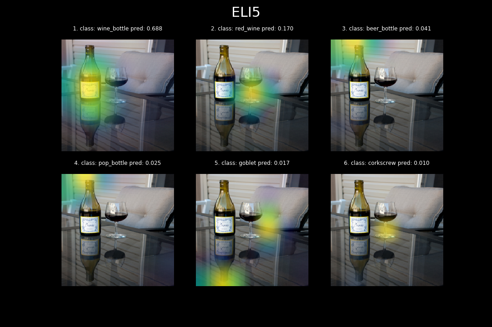
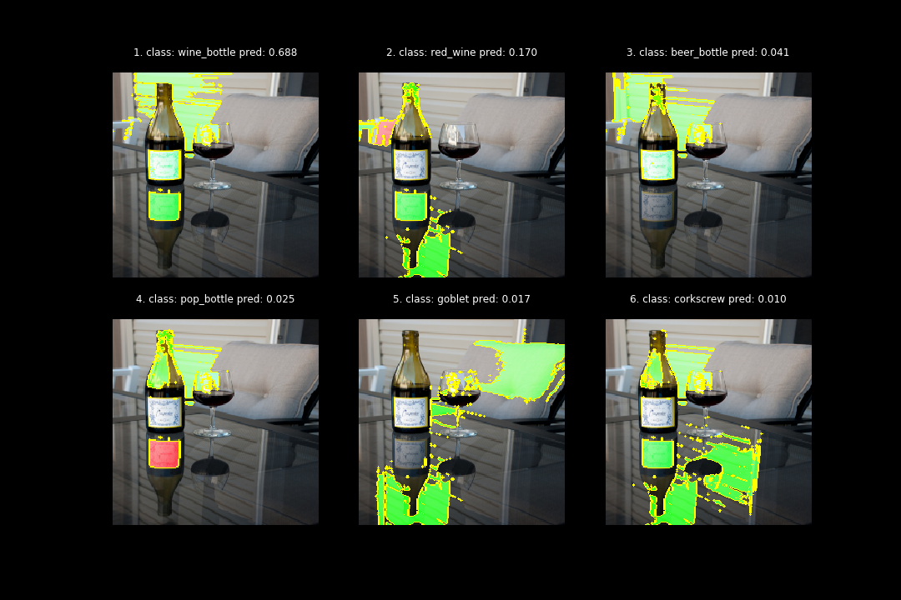
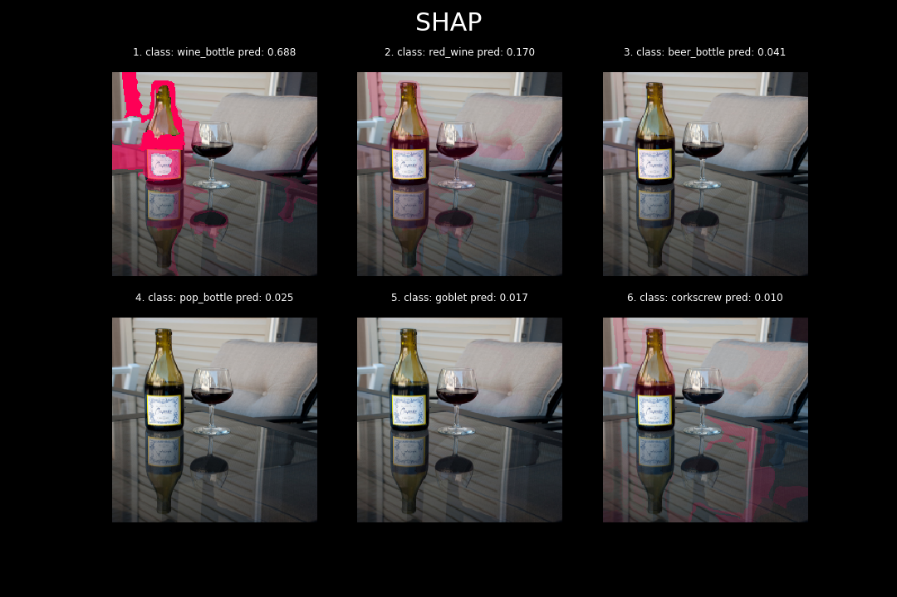

# Knowing What and Why? - Explaining Image Classifier Predictions

## Description

As we implement highly responsible Computer Vision systems, it is becoming progressively clear that we must provide not only predictions but also explanations, as to what influenced its decision. In this post, I compared and benchmarked the most commonly used libraries for explaining the model predictions in the field of Image Classification - [Eli5][1], [LIME][2], and [SHAP][3]. I investigated the algorithms that they leverage, as well as compared the efficiency and quality of the provided explanations.

## Hit the ground running

Via Conda
```sh
# setup conda environment & install all required packages
conda env create -f environment.yml
# activate conda environment
conda activate ExplainingImageClassifiers
```

Via Virtualenv
```sh
# set up python environment
apt-get install python3-venv
python3 -m venv .env
# activate python environment
source .env/bin/activate
# install all required packages
pip install -r requirements.txt
```

## Download COCO Dataset

```sh
cd 01_coco_res_net
sh get_coco_dataset_sample.sh
```

## ELI5

[Full code example][4]

The first library we will look into is Eli5 - it's a simple but reliable tool designed to visualize, inspect and debug ML models. The library allows, among other things, to interpret the predictions of Image Classifiers written in Keras. To do it, Eli5 leverages Gradient-weighted Class Activation Mapping (Grad-CAM) algorithm. It is worth noting that this is not a general approach and it applies only to CNN solutions.

<p align="center"> 
    
</p>

<p align="center"> 
    <b>Figure 1.</b> Explanations provided by ELI5
</p>

## LIME

[Full code example][5]

[Why Should I Trust You?: Explaining the Predictions of Any Classifier][7] is an article that underlies the entire branch of research aimed at explaining ML models. The ideas included in this paper became the foundation for the most popular of the interpretation libraries - Local interpretable model-agnostic explanations (LIME). This algorithm is completely different from Grad-CAM - tries to understand the model by perturbating the input data and understanding how these changes affect the predictions.

<p align="center"> 
    
</p>

<p align="center"> 
    <b>Figure 1.</b> Explanations provided by LIME
</p>

## SHAP

[Full code example][6]

SHapley Additive exPlanations (SHAP) and LIME are quite similar - both are additive and model-agnostic methods of explaining individual predictions. SHAP however, aims to explain model prediction for given input by computing the contribution of each feature to this prediction. To achieve this goal, SHAP uses Shapley Values, which originally comes from game theory.

<p align="center"> 
    
</p>

<p align="center"> 
    <b>Figure 1.</b> Explanations provided by SHAP
</p>

[1]: https://github.com/TeamHG-Memex/eli5
[2]: https://github.com/marcotcr/lime
[3]: https://github.com/slundberg/shap
[4]: "./01_coco_res_net/coco-resnet-keras-resnet-34-eli5.ipynb"
[5]: "./01_coco_res_net/coco-resnet-keras-resnet-34-lime.ipynb"
[6]: "./01_coco_res_net/coco-resnet-keras-resnet-34-shap.ipynb"
[7]: https://arxiv.org/abs/1602.04938
