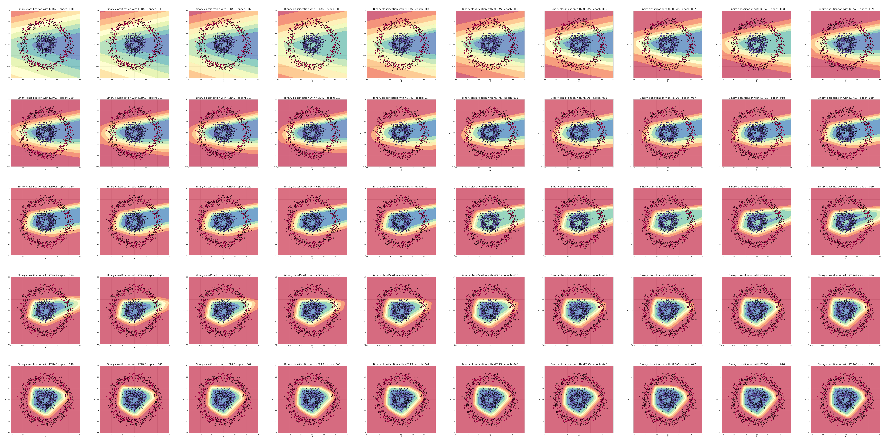

<h1 align="center">ILearnDeepLearning.py</h1>

## Description

This repository contains small projects related to Neural Networks and Deep Learning in general. Subject are closely linekd with articles I publish on [Medium][1]. I encourage you both to read as well as to check how the code works in the action.

## Hit the ground running

``` bash
# clone repository
git clone https://github.com/SkalskiP/ILearnDeepLearning.py.git

# navigate to main directory
cd ILearnDeepLearning.py

# set up and activate python environment
python3 -m venv .env
source .env/bin/activate

# install all required packages
pip install -r requirements.txt
```

## Deep Dive into Math Behind Deep Networks

This project is mainly focused on visualizing quite complex issues related to gradient descent, activation functions and visualization of classification boundaries while teaching the model. It is a code that complements the issues described in more detail in the article [Deep Dive into Math Behind Deep Networks][2]. Here are some of the visualizations that have been created.

<p align="center"> 
    
    
</p>

<p align="center"> 
    <b>Figure 1.</b> A classification boundaries graph created in every iteration of the Keras model.</br>
    Finally, the frames were combined to create an animation.
</p>

<p align="center"> 
    
</p>

<p align="center"> 
    <b>Figure 2.</b> Visualization of the gradient descent.
</p>

[1]: https://medium.com/@piotr.skalski92
[2]: https://towardsdatascience.com/https-medium-com-piotr-skalski92-deep-dive-into-deep-networks-math-17660bc376ba
