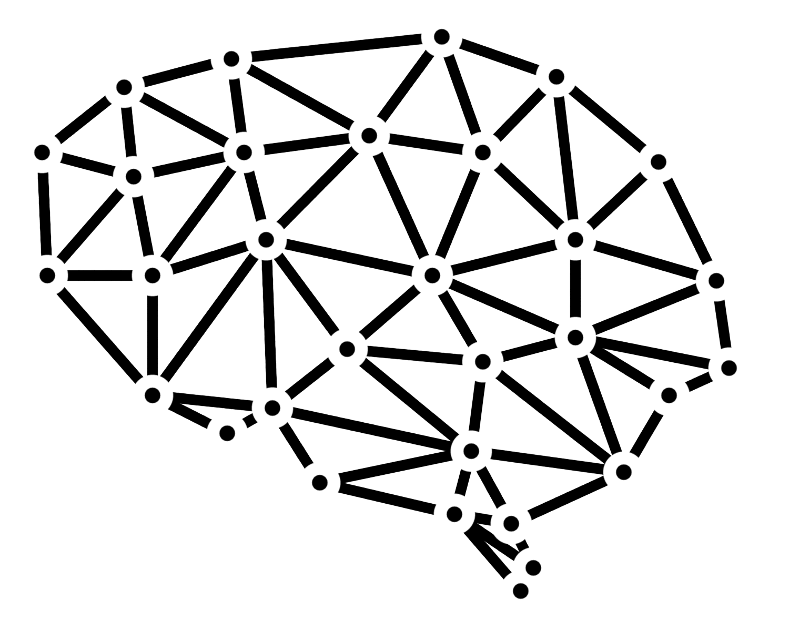
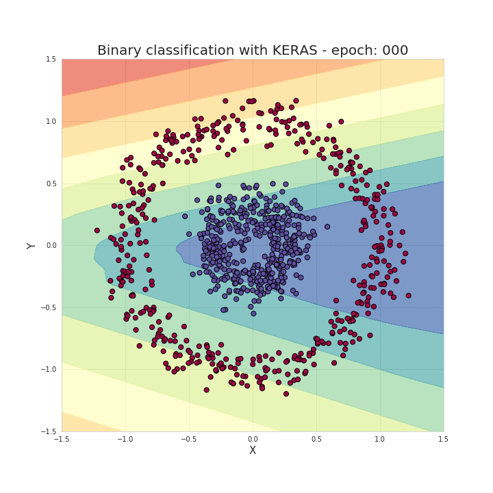
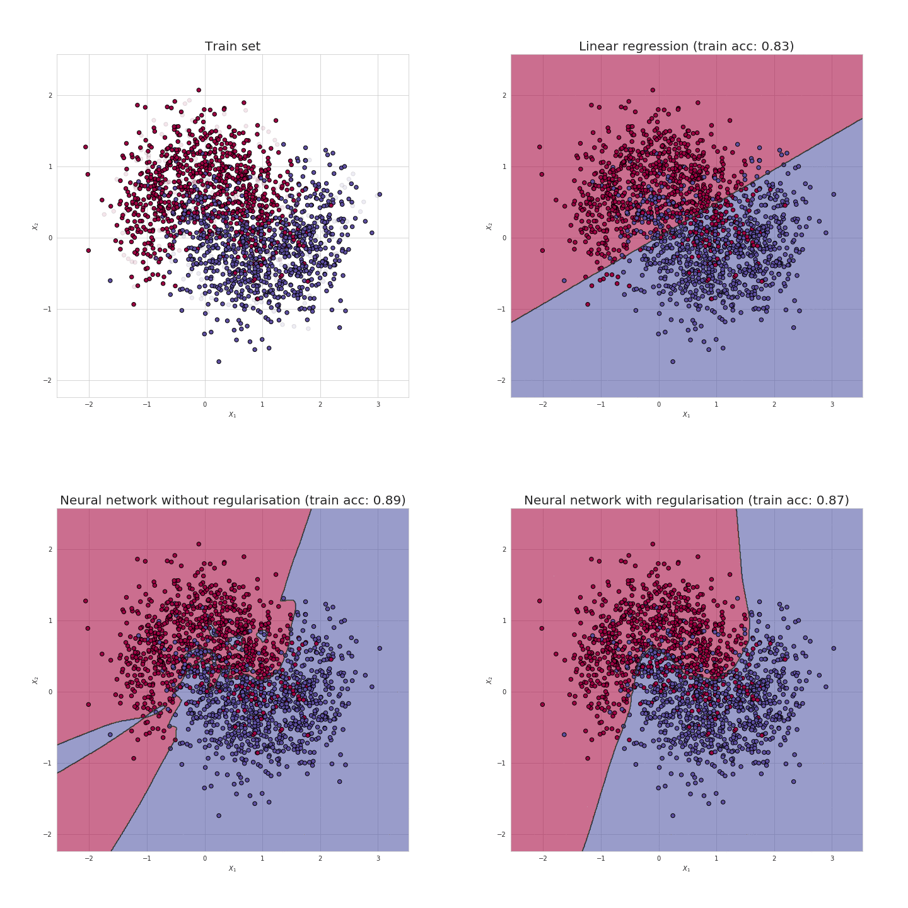
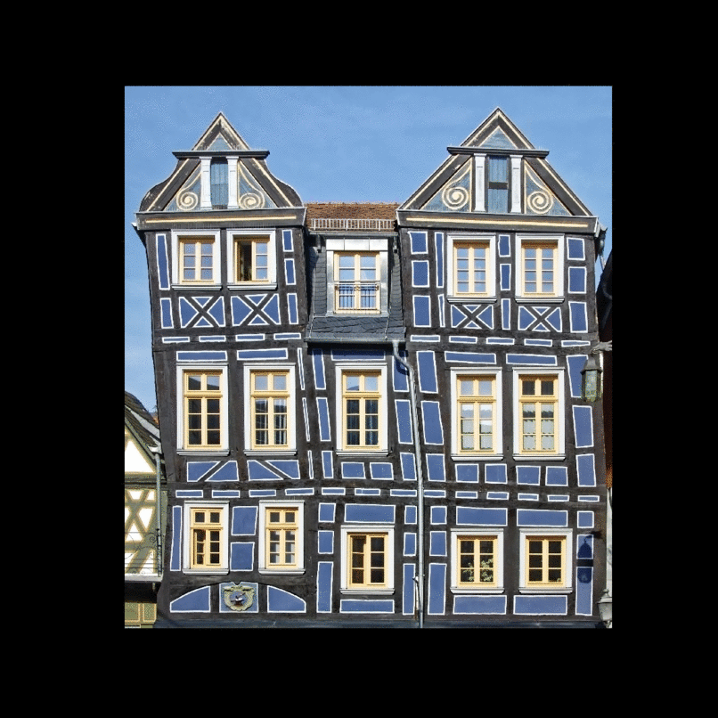
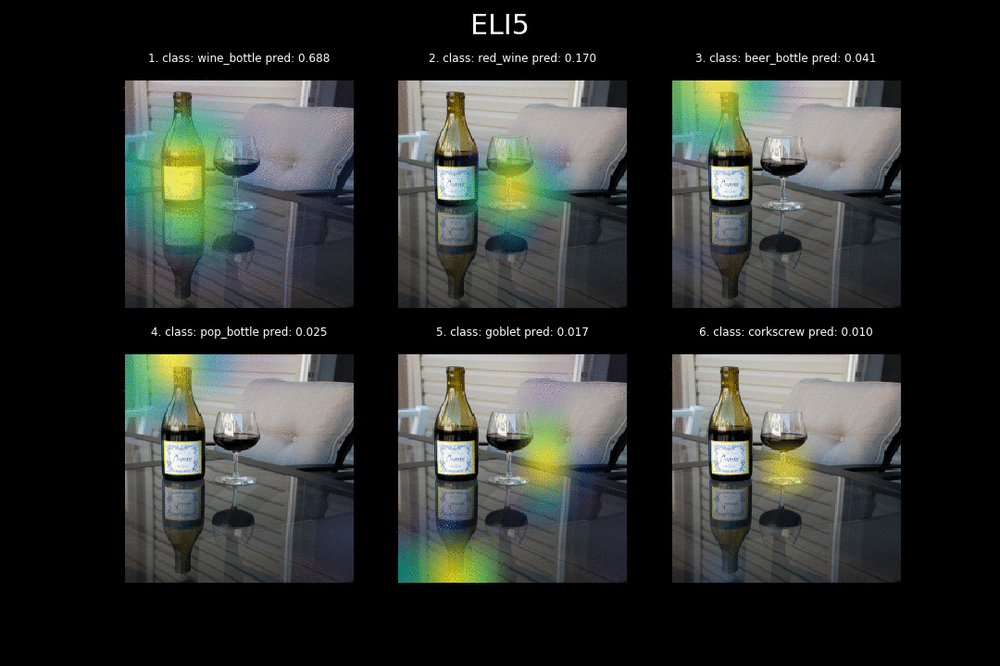

<h1 align="center">ILearnDeepLearning.py</h1>

<p align="center"> 
    
</p>

## Description

People say that nothing develops and teaches you like getting your hands dirty. This repository contains small projects mostly related to Deep Learning but also Data Science in general. Subjects are closely linekd with articles I publish on [Medium][1] and are intended to complement those blog posts. For me it is a way to document my learning process, but also to help others understand neural network related issues. I hope that the content of the repository will turn out to be interesting and, above all, useful. I encourage you both to read my posts as well as to check how the code works in the action.

## Hit the ground running

``` bash
# clone repository
git clone https://github.com/SkalskiP/ILearnDeepLearning.py.git

# navigate to main directory
cd ILearnDeepLearning.py

# set up and activate python environment
apt-get install python3-venv
python3 -m venv .env
source .env/bin/activate

# install all required packages
pip install -r requirements.txt
```

## Deep Dive into Math Behind Deep Networks
[Medium articule][2] - [Source code](./01_mysteries_of_neural_networks/01_mathematics_of_nn/)

This project is mainly focused on visualizing quite complex issues related to gradient descent, activation functions and visualization of classification boundaries while teaching the model. It is a code that complements the issues described in more detail in the article. Here are some of the visualizations that have been created.

<p align="center"> 
    
    
</p>

<p align="center"> 
    <b>Figure 1.</b> A classification boundaries graph created in every iteration of the Keras model.</br>
    Finally, the frames were combined to create an animation. 
</p>

<p align="center"> 
    
</p>

<p align="center"> 
    <b>Figure 2.</b> Visualization of the gradient descent.
</p>

## Let’s code a Neural Network in plain NumPy
[Medium articule][11] - [Source code](./01_mysteries_of_neural_networks/03_numpy_neural_net/)

After a theoretical introduction, the time has come for practical implementation of the neural network using NumPy. In this notebook you will find full source code and a comparison of the performance of the basic implementation with the model created with Keras. You can find a wider commentary to understand the order and meaning of performed functions in a related article.

<p align="center"> 
    
</p>

<p align="center"> 
    <b>Figure 3.</b> Visualisation of the classification boundaries achieved with simple NumPy model
</p>

## Preventing Deep Neural Network from Overfitting
[Medium articule][3] - [Source code](./01_mysteries_of_neural_networks/02_exploring_overfitting/)

This time I focused on the analysis of the reasons for overfitting and ways to prevent it. I made simulations of neural network regulation for different lambda coefficients, analyzing the change of values in the weight matrix. Take a look at the visualizations that were created in the process. 

<p align="center"> 
    
</p>

<p align="center"> 
    <b>Figure 4.</b> Classification boundaries created by: top right corner - linear regression;</br>
    bottom left corner - neural network; bottom right corner - neural network with regularisation
</p>

<p align="center"> 
    
</p>

<p align="center"> 
    <b>Figure 5.</b> Change of accuracy values in subsequent epochs during neural network learning.
</p>

## How to train Neural Network faster with optimizers?
[Medium articule][16] - [Source code](./01_mysteries_of_neural_networks/04_optimizers/)

As I worked on the last article, I had the opportunity to create my own neural network using only Numpy. It was a very challenging task, but at the same time it significantly broadened my understanding of the processes that take place inside the NN.  Among others, this experience made  me truly realize how many factors influence neural net's performance. Selected architecture,proper hyperparameter values or even correct initiation of parameters, are just some of those things... This time however, we will focus on the decision that has a huge impact on learning process speed, as well as the accuracy of obtained predictions - the choice of the optimization strategy.


<p align="center"> 
    
</p>

<p align="center"> 
    <b>Figure 6.</b> Examples of points which are a problem for optimization algorithms.
</p>

<p align="center"> 
    
</p>

<p align="center"> 
    <b>Figure 7.</b> Optimizers comparison.
</p>

## Simple Method of Creating Animated Graphs
[Medium articule][4] - [Source code](./02_data_science_toolkit/01_animated_graphs/)

Both in my articles and projects I try to create interesting visualizations, which very often allow me to communicate my ideas much more effectively. I decided to create a short tutorial to show you how to easily create animated visualizations using Matplotlib. I also encourage you to read my post where I described, among other things, how to create a visualization of neural network learning process.

<p align="center"> 
    
</p>

<p align="center"> 
    <b>Figure 8.</b> Lorenz Attractor created using the Matplotlib animation API.
</p>

## Gentle Dive into Math Behind Convolutional Neural Networks
[Medium articule][17] - [Source code](./01_mysteries_of_neural_networks/05_mathematics_of_cnn/)

In this post on Medium I focused on the theoretical issues related to CNNs. It is a preparation for the upcoming mini project, which aims to create my own, simple implementation of this type of the Neural Network. As a result, this section of the repository is quite narrow and includes mainly simple visualizations of the effects of a convolution with a selected filter.

<p align="center"> 
    
</p>

<p align="center"> 
    <b>Figure 9.</b> Convolutionary effect with selected filters.
</p>

## Chess, rolls or basketball? Let's create a custom object detection model
[Medium articule][19] - [Source code](./02_data_science_toolkit/02_yolo_object_detection)

My posts on the Medium are usually very theoretical - I tend to analyse and describe the algorithms that define how Neural Networks work. This time, however, I decided to break this trend and show my readers how easy it is to train your own YOLO model, capable of detecting any objects we choose. In order to achieve this goal, we will need help from a very useful and easy-to-use [implementation of YOLO][18]. In short, not much coding, but a huge effect. 

<p align="center"> 
    
</p>

<p align="center"> 
    <b>Figure 10.</b> Detection of players moving around the basketball court, </br> based on <a href="https://research.google.com/youtube8m/">YouTube-8M</a> dataset.
</p>

## Knowing What and Why? - Explaining Image Classifier Predictions
[Medium articule][23] - [Source code](./02_data_science_toolkit/03_explaining_image_classifier_predictions)

As we implement highly responsible Computer Vision systems, it is becoming progressively clear that we must provide not only predictions but also explanations, as to what influenced its decision. In this post, I compared and benchmarked the most commonly used libraries for explaining the model predictions in the field of Image Classification - [Eli5][19], [LIME][20], and [SHAP][21]. I investigated the algorithms that they leverage, as well as compared the efficiency and quality of the provided explanations.

<p align="center"> 
    
</p>

<p align="center"> 
    <b>Figure 11.</b> Comparison of explanations provided by ELI5, LIME and SHAP
</p>

## License

This project is licensed under the MIT License - see the [LICENSE.md][6] file for details

## Interesting materials and ideas

This is a place where I collect links to interesting articles and papers, which I hope will become the basis for my next projects in the future.

1. [Man is to Computer Programmer as Woman is to Homemaker? Debiasing Word Embeddings][5]
2. [Sequence to Sequence Learning with Neural Networks][7]
3. [Learning Phrase Representations using RNN Encoder-Decoder for Statistical Machine Translation][8]
4. [BLEU: a Method for Automatic Evaluation of Machine Translation][9]
5. [Neural Machine Translation by Jointly Learning to Align and Translate][10]
6. [A (Long) Peek into Reinforcement Learning][12]
7. [Why Momentum Really Works][13]
8. [Improving the way neural networks learn][14]
9. [Classification and Loss Evaluation - Softmax and Cross Entropy Loss][15]

[1]: https://medium.com/@piotr.skalski92
[2]: https://towardsdatascience.com/https-medium-com-piotr-skalski92-deep-dive-into-deep-networks-math-17660bc376ba
[3]: https://towardsdatascience.com/preventing-deep-neural-network-from-overfitting-953458db800a
[4]: https://towardsdatascience.com/simple-method-of-creating-animated-graphs-127c11f58cc5
[5]: https://arxiv.org/abs/1607.06520
[6]: ./LICENSE.md
[7]: https://arxiv.org/abs/1409.3215
[8]: https://arxiv.org/abs/1406.1078
[9]: https://www.aclweb.org/anthology/P02-1040.pdf
[10]: https://arxiv.org/abs/1409.0473
[11]: https://towardsdatascience.com/lets-code-a-neural-network-in-plain-numpy-ae7e74410795
[12]: https://lilianweng.github.io/lil-log/2018/02/19/a-long-peek-into-reinforcement-learning.html#sarsa-on-policy-td-control
[13]: https://distill.pub/2017/momentum/
[14]: http://neuralnetworksanddeeplearning.com/chap3.html
[15]: https://deepnotes.io/softmax-crossentropy
[16]: https://towardsdatascience.com/how-to-train-neural-network-faster-with-optimizers-d297730b3713
[17]: https://towardsdatascience.com/gentle-dive-into-math-behind-convolutional-neural-networks-79a07dd44cf9
[18]: https://github.com/ultralytics/yolov3
[19]: https://towardsdatascience.com/chess-rolls-or-basketball-lets-create-a-custom-object-detection-model-ef53028eac7d
[20]: https://github.com/TeamHG-Memex/eli5
[21]: https://github.com/marcotcr/lime
[22]: https://github.com/slundberg/shap
[23]: https://towardsdatascience.com/knowing-what-and-why-explaining-image-classifier-predictions-680a15043bad
